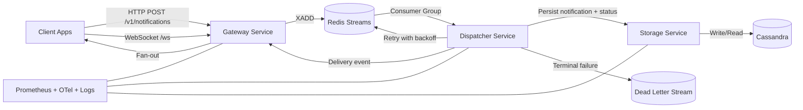
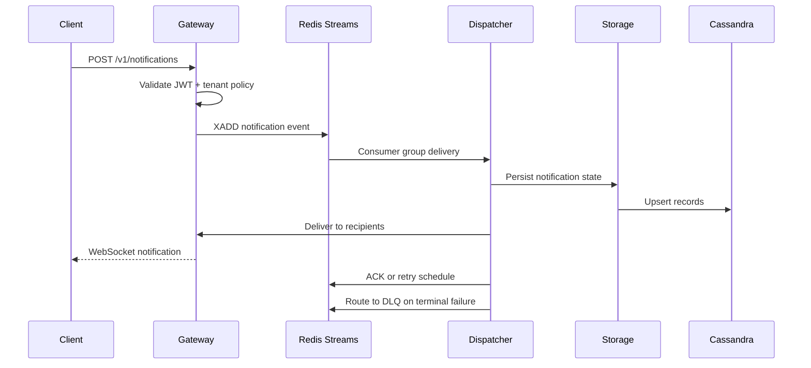
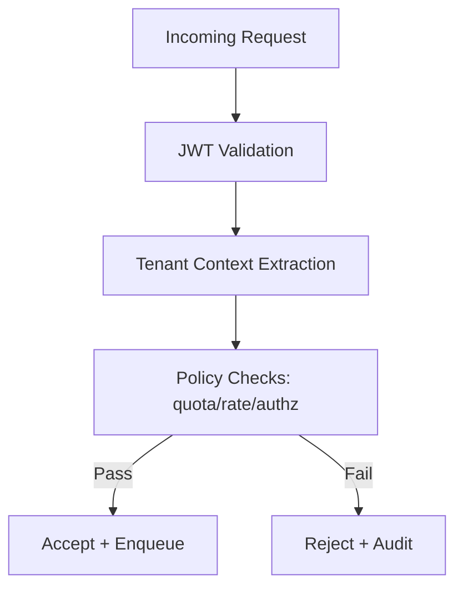

# Multi-Tenant Notification Platform

A production-grade, event-driven notification platform for low-latency, reliable delivery across tenants. The system combines modern C++ services, Redis Streams, Cassandra persistence, WebSocket fan-out, and full observability for scale-ready operation.

---

## Table of Contents

- [Overview](#overview)
- [What This System Delivers](#what-this-system-delivers)
- [Architecture](#architecture)
- [Coordination and Runtime Control](#coordination-and-runtime-control)
- [Core Services](#core-services)
- [Data and Delivery Flow](#data-and-delivery-flow)
- [APIs](#apis)
- [Storage Model](#storage-model)
- [Reliability and Delivery Guarantees](#reliability-and-delivery-guarantees)
- [Security and Tenant Isolation](#security-and-tenant-isolation)
- [Observability and SLOs](#observability-and-slos)
- [Performance Profile](#performance-profile)
- [Local Deployment](#local-deployment)
- [Production Deployment](#production-deployment)
- [Repository Layout](#repository-layout)

---

## Overview

Multi-Tenant Notification Platform is designed for real-time event delivery under mixed tenant workloads. It supports durable ingestion, controlled retries, dead-letter handling, and low-latency WebSocket delivery for active clients.

The platform is built around:

- C++ service boundaries for gateway, dispatching, and storage
- Redis Streams consumer groups for durable event routing
- Cassandra for NoSQL persistence and tenant-partitioned query patterns
- WebSocket delivery path for live notifications
- Prometheus/Grafana/OpenTelemetry for production observability

---

## What This System Delivers

- Tenant-scoped notification ingestion with policy enforcement
- Reliable stream processing with retry, backoff, and DLQ routing
- Real-time fan-out to active WebSocket sessions
- Idempotent notification persistence and delivery state tracking
- Per-tenant quotas, rate limiting, and operational controls
- Replay workflows for dead-letter recovery
- End-to-end metrics, tracing, and structured logs

---

## Architecture



Runtime layers:

- Edge layer: Gateway API + WebSocket session manager
- Processing layer: Dispatcher consumer workers + retry/DLQ logic
- Data layer: Storage adapter + Cassandra data model
- Control layer: Metrics, traces, health checks, and alerting

---

## Coordination and Runtime Control

Coordination responsibilities in this architecture:

- Redis Streams consumer groups coordinate worker ownership and pending-entry recovery.
- Dispatcher workers manage retry scheduling and DLQ transitions.
- Kubernetes/ECS orchestration manages service lifecycle, autoscaling, probes, and networking.
- Tenant policy controls enforce quota, rate, and retention boundaries during ingress and processing.

Operationally, this separates event durability and worker coordination from compute orchestration.

---

## Core Services

- `gateway`
  - Ingress endpoint (`POST /v1/notifications`)
  - JWT validation and tenant context binding
  - WebSocket connection/session management
  - Subscription and live fan-out handling

- `dispatcher`
  - Stream consumer-group processing
  - Retry policy execution with exponential backoff
  - DLQ routing for exhausted failures
  - Delivery outcome publication and status updates

- `storage`
  - Cassandra persistence interface
  - Idempotent writes for notification records
  - Delivery status and tenant audit query operations

---

## Data and Delivery Flow

### Ingestion Flow

1. Client sends notification payload to gateway.
2. Gateway validates auth and tenant policy.
3. Gateway publishes envelope to Redis Stream.
4. Dispatcher consumes event from consumer group.
5. Storage persists notification and attempt state in Cassandra.

### Delivery Flow

1. Dispatcher forwards delivery event to gateway fan-out path.
2. Gateway delivers to active tenant-authenticated WebSocket clients.
3. On transient failure, dispatcher retries with backoff.
4. On terminal failure, dispatcher moves event to DLQ.
5. Delivery metrics and traces are emitted for observability.



---

## APIs

### REST

- `POST /v1/notifications` - submit notification event
- `GET /v1/notifications/{id}` - fetch notification state
- `GET /v1/tenants/{tenantId}/deliveries` - tenant delivery history
- `GET /health` - liveness/readiness status

Example:

```bash
curl -X POST http://localhost:8080/v1/notifications \
  -H "Content-Type: application/json" \
  -H "Authorization: Bearer <token>" \
  -d '{
    "tenant_id": "tenant-a",
    "user_id": "user-123",
    "channel": "alerts",
    "content": "Deployment completed",
    "priority": "normal"
  }'
```

### WebSocket

- `GET /ws` - authenticated realtime channel
- Supports tenant-bound subscriptions and server-side heartbeat handling

---

## Storage Model

Primary storage components:

- Redis Streams for durable ingest and consumer-group processing
- Cassandra for notification persistence and delivery-state records

Representative entities:

- `notifications` (tenant_id, notification_id, payload, created_at)
- `delivery_status` (tenant_id, notification_id, recipient_id, state, attempts, last_error)
- `tenant_audit_log` (tenant_id, event_type, event_time, metadata)

Partitioning and access are tenant-first to preserve isolation and predictable query behavior.

---

## Reliability and Delivery Guarantees

- At-least-once processing with idempotent writes
- Pending-entry recovery for consumer restarts
- Exponential backoff retry strategy
- Dead-letter routing for terminal failure states
- Replay tooling for DLQ recovery workflows
- Backpressure controls for overload and slow consumers

---

## Security and Tenant Isolation

- JWT authentication on REST and WebSocket entry points
- Tenant-bound authorization for all operations
- Payload validation and input sanitation
- Per-tenant quotas and rate-limiting controls
- Structured audit trails for critical state transitions



---

## Observability and SLOs

Telemetry coverage:

- Prometheus metrics for throughput, latency, retries, lag, and DLQ
- OpenTelemetry traces across gateway -> dispatcher -> storage
- Structured JSON logs with correlation and tenant identifiers

Primary metrics:

- `notifications_ingested_total`
- `notifications_delivered_total`
- `delivery_latency_ms`
- `stream_consumer_lag`
- `retry_attempts_total`
- `dlq_events_total`
- `websocket_active_sessions`

Service objectives:

- p95 end-to-end delivery latency under defined SLA envelope
- delivery success rate greater than 99%
- bounded consumer lag under sustained tenant traffic

---

## Performance Profile

Validated benchmark profile (k6 suites):

- Multi-tenant mixed notification traffic
- Steady-state + burst scenarios
- Reconnect storm and slow-consumer stress tests
- Sustained high-concurrency WebSocket sessions

Latency budget model:

- Gateway validation + enqueue: bounded low-latency path
- Stream dispatch + storage write: deterministic worker budget
- WebSocket fan-out + ack state update: final delivery budget

---

## Local Deployment

Prerequisites:

- CMake 3.20+
- C++20 compiler
- Docker + Docker Compose

Build and run:

```bash
cd platform/infra
docker compose -f docker-compose.local.yml up -d

cd ../..
cd platform
cmake -S . -B build
cmake --build build
```

---

## Production Deployment

The platform is containerized and deployment-ready for orchestrated runtimes.

Supported production model:

- Horizontal scale for gateway and dispatcher workers
- Health probes and rolling updates
- Policy-driven autoscaling based on lag/latency/session saturation
- Centralized metrics, tracing, and log aggregation

---

## Repository Layout

- `docs/system-architecture.md` - architecture reference
- `docs/operations-runbook.md` - runtime and incident operations
- `platform/common/` - shared contracts and utilities
- `platform/services/notification-gateway/` - ingress and websocket edge service
- `platform/services/notification-dispatcher/` - stream processing and delivery orchestration
- `platform/services/notification-storage/` - persistence adapter and query operations
- `platform/infra/` - local infrastructure definitions (Redis, Cassandra)
- `platform/tests/load/k6/` - load and reliability test suites
