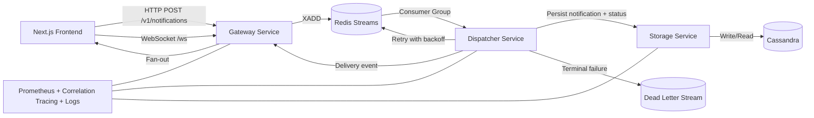
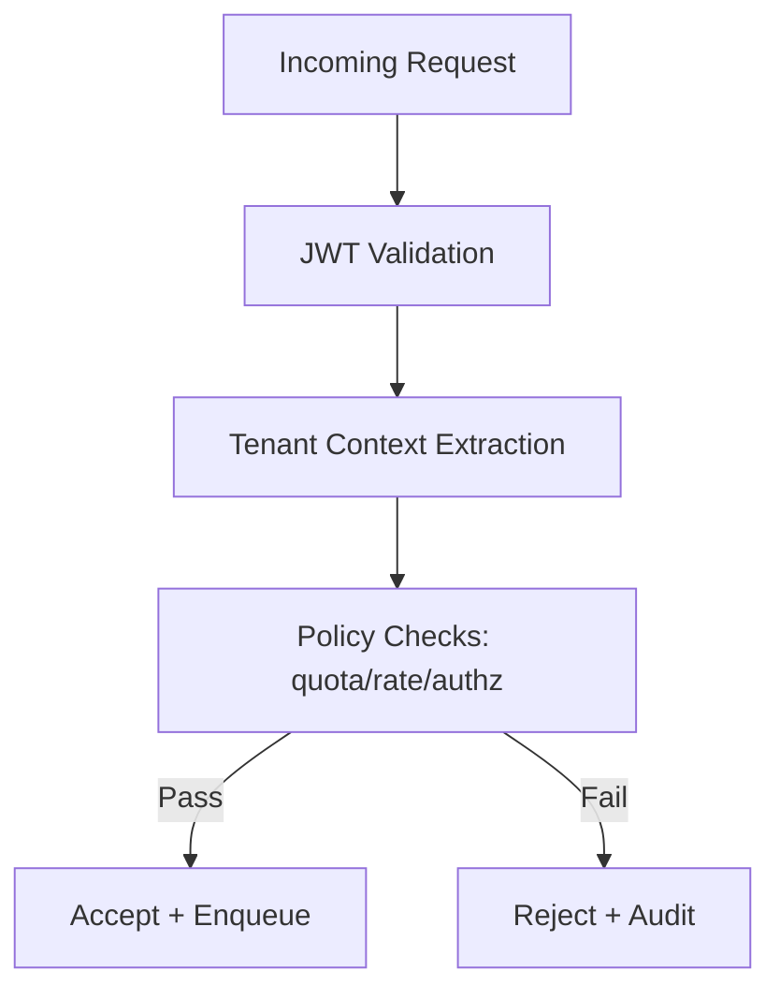

# Multi-Tenant Notification Platform

An evolution of my earlier project of a notification system made in Go, MySQL, and Redis
(Link: https://github.com/arup-chauhan/Realtime-Notification-System)

This is a production-grade, event-driven notification platform for low-latency, reliable delivery across tenants. The system combines modern C++ services, Redis Streams, Cassandra persistence, WebSocket fan-out, and full observability for scale-ready operation.

---

## Table of Contents

- [Overview](#overview)
- [What This System Delivers](#what-this-system-delivers)
- [Architecture](#architecture)
- [Architecture and Design Principles](#architecture-and-design-principles)
- [Coordination and Runtime Control](#coordination-and-runtime-control)
- [Core Services](#core-services)
- [Data and Delivery Flow](#data-and-delivery-flow)
- [APIs](#apis)
- [Storage Model](#storage-model)
- [Reliability and Delivery Guarantees](#reliability-and-delivery-guarantees)
- [Security and Tenant Isolation](#security-and-tenant-isolation)
- [Observability and SLOs](#observability-and-slos)
- [Performance Profile](#performance-profile)
- [Load Testing](#load-testing)
- [End-to-End Smoke Test](#end-to-end-smoke-test)
- [Local Deployment](#local-deployment)
- [Frontend (Next.js + TypeScript)](#frontend-nextjs--typescript)
- [Production Deployment](#production-deployment)
- [Security Policy](#security-policy)
- [Repository Layout](#repository-layout)

---

## Overview

This platform is designed for real-time event delivery under mixed tenant workloads. It supports durable ingestion, controlled retries, dead-letter handling, and low-latency WebSocket delivery for active clients.

The platform is built around:

- C++ service boundaries for gateway, dispatching, and storage
- Redis Streams consumer groups for durable event routing
- Cassandra for NoSQL persistence and tenant-partitioned query patterns
- WebSocket delivery path for live notifications
- Prometheus-compatible `/metrics` exposure and structured service logs

---

## What This System Delivers

- Tenant-scoped notification ingestion with policy enforcement
- Reliable stream processing with retry, backoff, and DLQ routing
- Real-time fan-out to active WebSocket sessions
- Deterministic notification state upserts and delivery history tracking
- Per-tenant quotas, rate limiting, and operational controls
- Configurable retention TTL for persisted delivery/state records
- Replay workflows for dead-letter recovery
- End-to-end metrics, correlation tracing, and structured logs

---

## Architecture



Runtime layers:

- Edge layer: Gateway API + WebSocket session manager
- Processing layer: Dispatcher consumer workers + retry/DLQ logic
- Data layer: Storage adapter + Cassandra data model
- Control layer: Metrics, correlation tracing, health checks, and alerting

---

## Coordination and Runtime Control

Coordination responsibilities in this architecture:

- Redis Streams consumer groups coordinate worker ownership and pending-entry recovery.
- Dispatcher workers manage retry scheduling and DLQ transitions.
- Kubernetes orchestration manages service lifecycle, probes, and networking.
- Kubernetes HPA manifests provide CPU-based autoscaling for gateway and dispatcher.
- Tenant policy controls enforce quota, rate, and retention boundaries during ingress and processing.

Operationally, this separates event durability and worker coordination from compute orchestration.

---

## Core Services

- `gateway`
  - Ingress endpoint (`POST /v1/notifications`)
  - JWT validation and tenant context binding
  - WebSocket connection/session management
  - Subscription and live fan-out handling

- `dispatcher`
  - Stream consumer-group processing
  - Retry policy execution with exponential backoff
  - DLQ routing for exhausted failures
  - Delivery outcome publication and status updates

- `storage`
  - Cassandra persistence interface
  - State upsert and append-only delivery history writes
  - Delivery status and tenant audit query operations

---

## Data and Delivery Flow

### Ingestion Flow

1. Client sends notification payload to gateway.
2. Gateway validates auth and tenant policy.
3. Gateway publishes envelope to Redis Stream.
4. Dispatcher consumes event from consumer group.
5. Storage persists notification and attempt state in Cassandra.

### Delivery Flow

1. Dispatcher forwards delivery event to gateway fan-out path.
2. Gateway delivers to active tenant-authenticated WebSocket clients.
3. On transient failure, dispatcher retries with backoff.
4. On terminal failure, dispatcher moves event to DLQ.
5. Delivery metrics and correlation traces are emitted for observability.


---

## APIs

### REST

- `POST /v1/notifications` - submit notification event
- `GET /v1/notifications/{id}` - fetch notification state
- `GET /v1/tenants/{tenantId}/deliveries` - tenant delivery history
- `GET /health` - liveness/readiness status
- `GET /metrics` - Prometheus-compatible gateway metrics
- `GET /metrics` on dispatcher (`:8092`) - stream processing metrics

Example:

```bash
curl -X POST http://localhost:8080/v1/notifications \
  -H "Content-Type: application/json" \
  -H "Authorization: Bearer <token>" \
  -d '{
    "tenant_id": "tenant-a",
    "user_id": "user-123",
    "channel": "alerts",
    "content": "Deployment completed",
    "priority": "normal"
  }'
```

### WebSocket

- `GET /ws` - authenticated realtime channel
- Supports tenant-bound subscriptions and server-side heartbeat handling
- Auth transport supports `Authorization: Bearer <token>` and query fallback `?access_token=<token>`
- Client must send a subscribe frame after connect:

```json
{ "type": "subscribe", "tenant_id": "tenant-a", "channel": "alerts" }
```

- Delivery fan-out is filtered by `tenant_id` + `channel` match

---

## Storage Model

Primary storage components:

- Redis Streams for durable ingest and consumer-group processing
- Cassandra for notification persistence and delivery-state records
- Storage audit shadow file for local read APIs (`STORAGE_DATA_FILE`)

Representative entities:

- `notification_state` (tenant_id, notification_id, user_id, channel, content, status, updated_ts)
- `delivery_status` (tenant_id, notification_id, status_ts, user_id, channel, content, status, attempt, error)
- `tenant_audit_log` (tenant_id, event_type, event_time, metadata)

Partitioning and access are tenant-first to preserve isolation and predictable query behavior.

---

## Reliability and Delivery Guarantees

- At-least-once processing with deterministic state upserts and append-only delivery history
- Pending-entry recovery for consumer restarts
- Exponential backoff retry strategy
- Dead-letter routing for terminal failure states
- Replay tooling for DLQ recovery workflows (`platform/tools/replay_dlq.sh`)
- Backpressure controls for overload and slow consumers
- Pending-entry recovery pass (`XREADGROUP ... 0`) before new stream reads

---

## Security and Tenant Isolation

- JWT authentication on REST and WebSocket entry points
- HS256 JWT signature validation on REST ingress (`POST /v1/notifications`)
- `GATEWAY_REQUIRE_AUTH=true` enforces bearer token requirement for HTTP and WebSocket entry
- JWT time claim checks: `exp` required, `nbf`/`iat` validated with configurable skew
- Tenant-bound authorization for all operations
- Payload validation and input sanitation
- Per-tenant quotas and rate-limiting controls
- Daily tenant quota enforcement (`TENANT_DAILY_QUOTA`) with Redis counters
- Structured audit trails for critical state transitions

Example tenant model:

```json
{
  "tenant_a": {
    "name": "Acme Corp",
    "users": ["u1", "u2"],
    "channels": ["alerts", "billing"]
  },
  "tenant_b": {
    "name": "Globex",
    "users": ["u9"],
    "channels": ["alerts"]
  }
}
```

In this model, a notification tagged with `tenant_id: "tenant_a"` is only processed, queried, and
delivered within tenant-a boundaries.



---

## Observability and SLOs

Telemetry coverage:

- Prometheus-compatible gateway metrics (`GET /metrics`)
- Prometheus-compatible dispatcher metrics (`GET /metrics` on `DISPATCHER_METRICS_PORT`)
- Structured JSON logs for ingress and dispatch lifecycle events
- Correlation-id propagation (`X-Correlation-Id`) - single stable identifier across gateway, dispatcher, storage, retries, DLQ, and replay

**Design Note:** The system follows DRY (Don't Repeat Yourself), YAGNI (You Aren't Gonna Need It), and Separation of Concerns principles. The architecture uses a single stable `correlation_id` for business tracking while keeping observability concerns (distributed tracing) separate and future-ready for OpenTelemetry integration. This refactoring eliminated 200+ lines of duplicate identifier plumbing, reduced function parameters by 37%, and fixed DLQ replay tracing issues. See [walkthrough/14_dry_principle_refactoring.md](walkthrough/14_dry_principle_refactoring.md) for detailed design rationale and migration guide.

Primary metrics:

- `notifications_ingested_total`
- `notifications_delivered_total`
- `dispatcher_events_consumed_total`
- `dispatcher_events_retry_scheduled_total`
- `dispatcher_events_dlq_total`
- `stream_consumer_lag`
- `dispatcher_message_processing_duration_ms_sum`
- `dispatcher_message_processing_duration_ms_count`
- `notifications_backpressure_rejected_total`
- `websocket_active_sessions`

Service objectives:

- p95 end-to-end delivery latency under defined SLA envelope
- delivery success rate greater than 99%
- bounded consumer lag under sustained tenant traffic

---

## Performance Profile

Target benchmark profile (k6 suites):

- Multi-tenant mixed notification traffic
- Steady-state + burst scenarios
- Reconnect storm and slow-consumer stress tests
- Sustained high-concurrency WebSocket sessions

Latency budget model:

- Gateway validation + enqueue: bounded low-latency path
- Stream dispatch + storage write: deterministic worker budget
- WebSocket fan-out + ack state update: final delivery budget

---

## Load Testing

This project uses both `k6` and `wrk`:

1. `k6` for HTTP + WebSocket scenario testing and scripting.
2. `wrk` for high-throughput HTTP baseline and ingress saturation testing.
3. Run both together with `platform/tests/load/run_all.sh`.

For Docker-network execution (recommended in containerized local runs), target service DNS directly:

- `GATEWAY_HTTP_BASE=http://mtnp-gateway:8080`
- `GATEWAY_WS_URL=ws://mtnp-gateway:8080/ws`

### k6

Install `k6` locally, then run from repository root.

HTTP smoke:

```bash
k6 run platform/tests/load/k6/smoke_submit.ts
```

HTTP steady load:

```bash
k6 run platform/tests/load/k6/steady_state.ts
```

HTTP burst:

```bash
k6 run platform/tests/load/k6/burst_spike.ts
```

WebSocket scenarios:

```bash
k6 run platform/tests/load/k6/websocket_fanout.ts
k6 run platform/tests/load/k6/reconnect_storm.ts
k6 run platform/tests/load/k6/slow_consumer.ts
```

WebSocket suites target the gateway `/ws` endpoint for realtime fan-out validation.

Save result artifacts:

```bash
k6 run --out json=platform/tests/load/k6/results/steady_state.json \
  platform/tests/load/k6/steady_state.ts
```

Note:

- `platform/tests/load/k6/results/steady_state.json` can be very large and is gitignored.
- Use `steady_state_summary.json` for commit-friendly benchmark tracking.

Use the helper runner:

```bash
bash platform/tests/load/k6/run_local.sh
```

Run via Docker network (no host port dependency):

```bash
docker run --rm --network multi-tenant-notification-platfrom_default \
  -v "$PWD/platform/tests/load/k6:/scripts" \
  grafana/k6 run \
  --summary-export=/scripts/results/steady_state_summary.json \
  -e GATEWAY_HTTP_BASE=http://mtnp-gateway:8080 \
  /scripts/steady_state.ts
```

Skip WebSocket scenarios when you only want HTTP:

```bash
HTTP_ONLY=true bash platform/tests/load/k6/run_local.sh
```

---

### wrk

Install `wrk` locally, then run from repository root.

HTTP health baseline:

```bash
wrk -t2 -c20 -d10s -s platform/tests/load/wrk/health_check.lua http://127.0.0.1:8080
```

Ingress stress:

```bash
wrk -t8 -c200 -d60s -s platform/tests/load/wrk/post_notifications.lua http://127.0.0.1:8080
```

Auth variant:

```bash
export WRK_BEARER_TOKEN="<token>"
wrk -t8 -c200 -d60s -s platform/tests/load/wrk/post_notifications_auth.lua http://127.0.0.1:8080
```

Use helper runner:

```bash
bash platform/tests/load/wrk/run_local.sh
```

Tune wrk load profile:

```bash
BASE_URL=http://127.0.0.1:8080 DURATION=45s THREADS=8 CONNECTIONS=300 \
  bash platform/tests/load/wrk/run_local.sh
```

Environment note:

- In this sandbox, Docker `wrk` images were amd64-only and crashed under arm64 emulation.
- Preferred path is native host `wrk` installation.
- Fallback path is running `wrk` inside `mtnp-gateway` (where `wrk` is installed) and redirecting output files back to the repo.

---

Run both suites in one command:

```bash
bash platform/tests/load/run_all.sh
```

---

## End-to-End Smoke Test

Run a single command to verify HTTP ingress, WebSocket delivery, Redis stream write, and Cassandra persistence:

```bash
bash platform/tests/e2e/smoke_e2e.sh
```

Run the full E2E suite:

```bash
bash platform/tests/e2e/run_all.sh
```

The script executes:

1. Service health checks
2. WebSocket + POST validation via `k6`
3. Redis stream entry verification
4. Cassandra `delivery_status` lookup validation
5. Auth-negative checks (when `JWT_HS256_SECRET` is set)

Environment overrides are documented in `platform/tests/README.md`.

Auth note:

1. Set `JWT_HS256_SECRET` to run smoke test in signed-token mode.
2. Or pass a custom token with `E2E_BEARER_TOKEN`.
3. If your Redis stream has a very large historical backlog, move consumer-group cursor to latest
   (`XGROUP SETID ... $`) before quick demo-only E2E runs.

---

## Local Deployment

Prerequisites:

- CMake 3.20+
- C++20 compiler
- Docker + Docker Compose

Build and run:

```bash
cd platform/infra
docker compose -f docker-compose.local.yml up -d
```

This starts:

1. `notification-gateway` on `:8080`
2. `notification-storage` on `:8090`
3. `notification-dispatcher` worker
4. Redis and Cassandra dependencies
5. `cassandra-init` schema bootstrap job

---

## Frontend (Next.js + TypeScript)

Run the frontend app:

```bash
cd frontend
npm install
npm run dev
```

Default frontend URL:

1. `http://localhost:3000`

Environment file:

1. `frontend/.env.example`
2. Optional bearer token env: `NEXT_PUBLIC_GATEWAY_BEARER_TOKEN`

Notes:

1. Submit flow (`POST /v1/notifications`) is active with current gateway.
2. Frontend sends `Authorization: Bearer` automatically when `NEXT_PUBLIC_GATEWAY_BEARER_TOKEN` (or UI token input) is present.
3. Realtime feed uses `ws://localhost:8080/ws`; when a token is provided, frontend appends it as `access_token` query for WebSocket auth fallback.

---

## Production Deployment

The platform is containerized and deployment-ready for orchestrated runtimes.

Supported production model:

- Horizontal scale for gateway and dispatcher workers
- Health probes and rolling updates
- CPU-based autoscaling (Kubernetes HPA)
- Prometheus metrics, correlation tracing, and structured logs (aggregation-ready)

Deployment artifacts:

- Kubernetes manifests: `platform/deploy/k8s/`
- Kubernetes HPA manifests: `platform/deploy/k8s/hpa.yaml`
- Minikube image build helper: `platform/deploy/k8s/build-images-minikube.sh`
- Benchmark result summary artifact: `platform/tests/load/results/benchmark-summary.md`

---

## Security Policy

Security contract and hardening guidance:

- `SECURITY.md`

---

## Architecture and Design Principles

This platform follows modern software engineering principles to ensure maintainability, clarity, and forward compatibility:

### DRY (Don't Repeat Yourself)

The system uses a **single stable identifier** pattern with `correlation_id` as the sole business tracking identifier. This eliminates duplication of trace_id throughout the codebase, reducing function parameters by 37% and removing 200+ lines of repetitive identifier plumbing code.

### YAGNI (You Aren't Gonna Need It)

Removed trace_id from application code since it didn't provide unique value over correlation_id. The system now focuses on essential functionality while remaining ready for future OpenTelemetry integration when distributed tracing is needed.

### Separation of Concerns

- **Business identity** (`correlation_id`) is cleanly separated from observability infrastructure (future OpenTelemetry)
- Application code doesn't manage distributed tracing identifiers
- Persistence layer stores only business-relevant state

**Benefits:**

- Simplified function signatures (8 parameters → 5 parameters)
- Cleaner Cassandra schema (removed 3 redundant columns)
- Fixed DLQ replay tracing behavior
- Backward-compatible migration path for existing deployments

For detailed design rationale, before/after code examples, and migration guide, see [walkthrough/14_dry_principle_refactoring.md](walkthrough/14_dry_principle_refactoring.md).

---

## Repository Layout

- `platform/common/` - shared contracts and utilities
- `platform/services/notification-gateway/` - ingress and websocket edge service
- `platform/services/notification-dispatcher/` - stream processing and delivery orchestration
- `platform/services/notification-storage/` - persistence adapter and query operations
- `platform/infra/` - local infrastructure definitions (Redis, Cassandra)
- `platform/deploy/k8s/` - Kubernetes deployment manifests
- `platform/tests/load/k6/` - load and reliability test suites
- `platform/tests/load/wrk/` - HTTP throughput and ingress baseline tests
- `platform/tests/e2e/` - end-to-end smoke verification scripts
- `walkthrough/` - detailed technical documentation and design decisions
- `frontend/` - Next.js + TypeScript operator console
